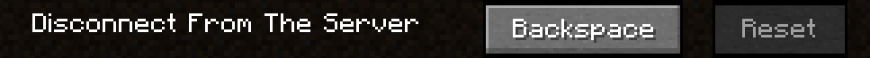

# Disconnect KeyBind

**Bind yourself a disconnect button!**

Perfect for: panic attacks, responsibility escapists, hardcore players.

*Fabric API and Fabric Language Kotlin is required!*

 

## Download

- [Modrinth](https://modrinth.com/mod/disconnect)

- [CurseForge](https://www.curseforge.com/minecraft/mc-mods/disconnect)

## License

Licensed under MIT. Check [LICENSE](LICENSE) file for details.
