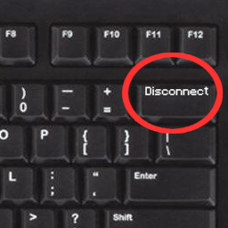

# Disconnect Keybind

**Bind yourself a disconnect button!**  
Perfect for: panic attacks, escapists, hardcore players.

*Fabric API and Fabric Language Kotlin is required!*

 

> Code in here is sitting under `shateq.disconnectkeybind.fabric` package

## Download 

[Modrinth](https://modrinth.com/mod/disconnect)  
[CurseForge](https://www.curseforge.com/minecraft/mc-mods/disconnect)  

---
### License
Project and repository are available under MIT license, check `LICENSE` file for details.
